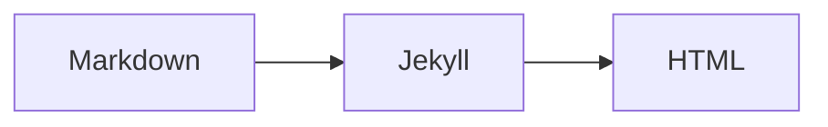

# 📚 KRaWL> Foundation – Dokumentation

Willkommen! 🎉 Die Dokumentation wurde neu organisiert und ist jetzt auf **drei Zielgruppen** aufgeteilt.

## 🎯 Dokumentation für deine Rolle

### 👥 Ich bin...

**🛠️ Entwickler/Entwicklerin**
→ **[ENTWICKLER.md](../ENTWICKLER.md)**
- Setup, Installation, Architektur
- CLI-Tools, Scraper-Framework
- Testing, CI/CD, Debugging
- Feature-Entwicklung

**📝 Redakteur/in oder Admin**
→ **[REDAKTION.md](../REDAKTION.md)**
- Event-Moderation & Review
- Telegram-Submissions prüfen
- Bulk-Operationen
- Content-Management

**🎉 Benutzer/in oder Power User**
→ **[BENUTZER.md](../BENUTZER.md)**
- Karte nutzen, Events entdecken
- Events einreichen (Telegram)
- Favoriten & Merkliste
- Tipps & Tricks

## 📦 Weitere Ressourcen

- **[FEATURE_REGISTRY.md](../FEATURE_REGISTRY.md)**: Vollständige Feature-Liste mit Status
- **[CONTRIBUTING.md](../CONTRIBUTING.md)**: Wie du zum Projekt beitragen kannst
- **[README.md](../README.md)**: Projekt-Übersicht

## 🗂️ Alte Dokumentation

Die vorherige, detaillierte Dokumentation wurde ins Archiv verschoben:

```
docs/archive/
├── 01-GETTING_STARTED.md      # Erste Schritte (alt)
├── PROJECT_SUMMARY.md          # Projekt-Zusammenfassung
├── WORKFLOWS.md                # GitHub Actions Details
├── TELEGRAM_SUBMISSIONS.md     # Telegram Bot Setup
├── SECRETS.md                  # Secrets Management
├── MAP_THEME_STATUS.md         # Map Theme Status
├── EVENT_MAP.md                # Event Map Details
└── CHAT_EXPORT_GUIDE.md        # Chat Export Guide
```

**Warum archiviert?**
Die neue Dokumentation ist schlanker, besser organisiert und auf die jeweilige Zielgruppe zugeschnitten. Die alten Dateien bleiben als Referenz erhalten.

## 📝 Dokumentations-Prinzipien

### 1. Learning-First

- **Keine Vorkenntnisse voraussetzen**
- Fachbegriffe beim ersten Vorkommen erklären
- Code-Beispiele MIT Kontext (nicht nur Snippets)

### 2. Strukturiert

Jedes Dokument hat:

```markdown
# Titel

> **Zielgruppe**: Einsteiger/Entwickler/Admin
> **Voraussetzungen**: Links zu anderen Docs
> **Zeitaufwand**: ~10 Minuten

## Übersicht
Kurze Zusammenfassung (2-3 Sätze)

## Inhalt
- [Abschnitt 1](#abschnitt-1)
- [Abschnitt 2](#abschnitt-2)

## Abschnitt 1
...

## Siehe auch
- [Andere Docs](link)
```

### 3. Code-Beispiele

```markdown
# ✅ Gut: Mit Kontext
```yaml
# _config.yml
title: "Meine Events"  # Wird in <title>-Tag genutzt
```

# ❌ Schlecht: Ohne Kontext
```yaml
title: "Meine Events"
```
```

### 4. Visuelle Hilfen

```markdown
# Diagramme (Mermaid)


# Warnungen
> ⚠️ **ACHTUNG**: Wichtiger Hinweis

# Tipps
> 💡 **TIPP**: Hilfreich zu wissen
```

## 🔍 Markdown-Konventionen

### Überschriften

```markdown
# H1: Nur Titel (1x pro Dokument)
## H2: Hauptabschnitte
### H3: Unterabschnitte
#### H4: Details (selten nutzen)
```

### Code-Blöcke

````markdown
```bash
# Shell-Befehl
./scripts/setup.sh
```

```yaml
# YAML-Config
key: value
```

```liquid
<!-- Liquid-Template -->
{{ page.title }}
```
````

### Listen

```markdown
# Unordered
- Item 1
- Item 2
  - Sub-Item

# Ordered
1. Schritt 1
2. Schritt 2
```

### Links

```markdown
# Intern (relative Pfade)
[Siehe Architektur](03-ARCHITECTURE.md)

# Extern
[Jekyll Docs](https://jekyllrb.com/)

# Mit Anker
[Siehe Abschnitt](#abschnitt-name)
```

### Tabellen

```markdown
| Spalte 1 | Spalte 2 | Spalte 3 |
|----------|----------|----------|
| Wert 1   | Wert 2   | Wert 3   |
```

## 🎨 Dokumentations-Generator (später)

In Phase 3 automatisieren wir:

```python
# scripts/docs/generate.py
"""
Generiert Dokumentation aus:
- Docstrings (Python)
- JSDoc-Kommentare (JavaScript)
- Frontmatter-Schemas (YAML)
"""
```

## 🔄 Versionierung

### Doc-Header

```markdown
---
title: "Getting Started"
version: "0.1.0"
last_updated: "2025-11-21"
status: "draft"  # draft, active, deprecated
---
```

### Änderungsprotokoll

Am Ende jedes Docs:

```markdown
## Changelog

- **2025-11-21**: Initial version (v0.1.0)
- **2025-12-01**: Added Federation section (v0.2.0)
```

## 🧪 Dokumentations-Tests (später)

```bash
# Prüft auf:
# - Broken Links
# - Veraltete Code-Beispiele
# - Fehlende Frontmatter
./scripts/test-docs.sh
```

## 📚 Weitere Infos

- **[Markdown Guide](https://www.markdownguide.org/)**
- **[Mermaid Diagrams](https://mermaid-js.github.io/)**
- **[Writing Docs Guide](https://www.writethedocs.org/)**

---

**Stand:** November 2025 | [Zurück zur Hauptdokumentation](../README.md)
